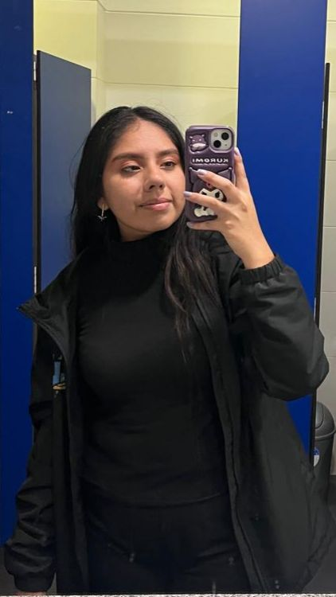
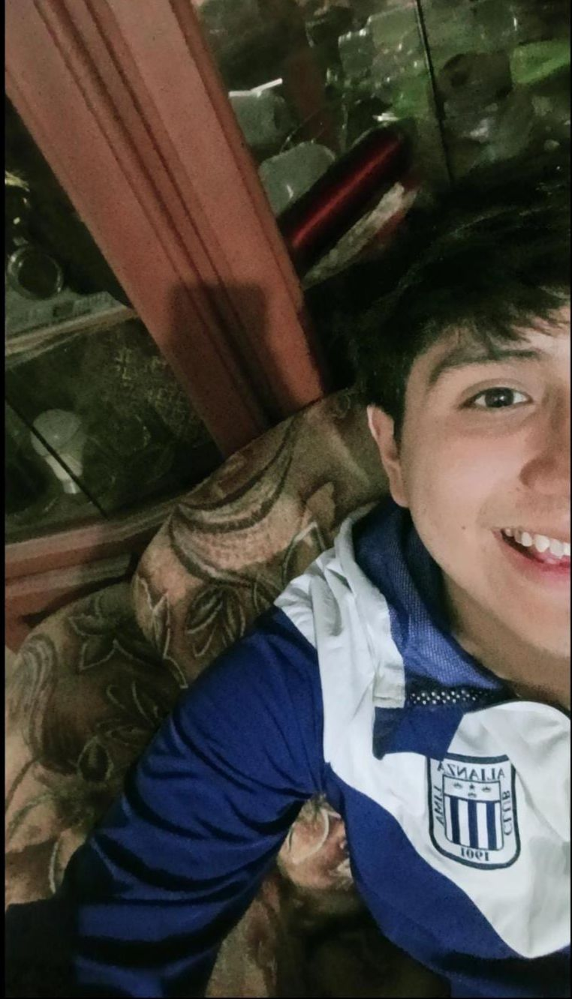
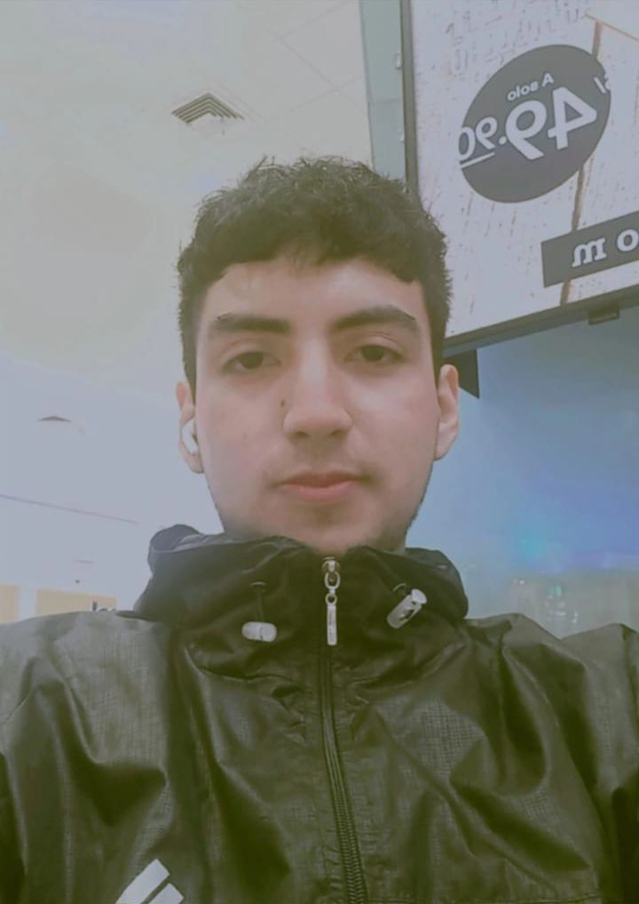

# MiniBootcamp - GRUPO 1
<table align="center">
    <tr>
        <td align="center" style="width: 25%;">
              
             <strong>Tracy Moriano</strong>
        </td>
        <td align="center" style="width: 25%;">
              
             <strong>César Cabrejos</strong>
        </td>
        <td align="center" style="width: 25%;">
              
             <strong>Johnson Palomino</strong>
        </td>
        <td align="center" style="width: 25%;">
              
             <strong>Jhostyn Malpartida</strong>
        </td>
        <td align="center" style="width: 25%;">
              
             <strong>Anderson Picoy</strong>
        </td>
        <td align="center" style="width: 25%;">
              
             <strong>Jesus Alvarado</strong>
        </td>
    </tr>
</table>

## Nivel
INTERMEDIO.

## Presentación

## Proyecto

## Archivos
- `README.md`